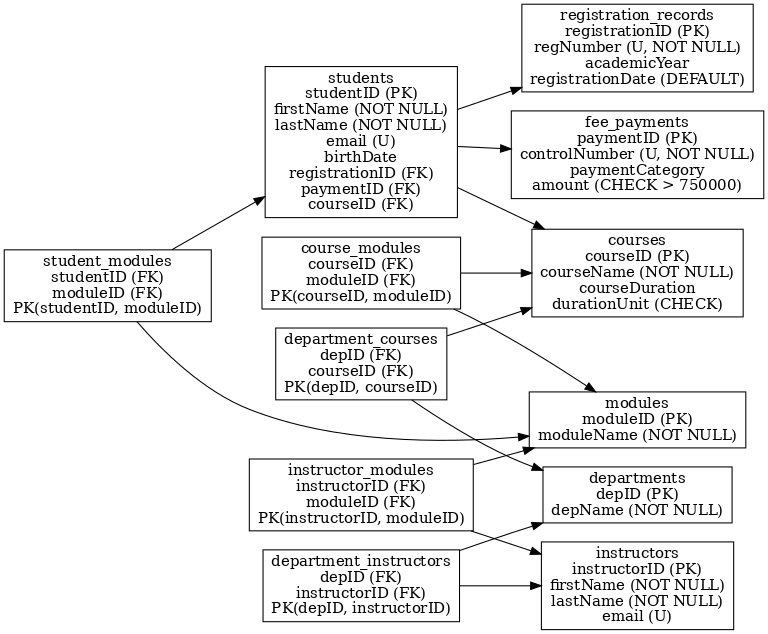

# 📚 StudentDB – Relational Database Schema for Student Records  

## 📖 Overview  
**StudentDB** is a relational database schema designed to manage a complete set of student records in an academic institution. It ensures **data integrity**, **consistency**, and **scalability** through the use of well-structured tables, proper constraints, and clear relationships among entities.  

This schema provides a robust foundation for:  
- Tracking student registration and course enrollment  
- Managing fee payments  
- Mapping courses to modules and instructors  
- Organizing departments, courses, and teaching staff  
- Supporting academic reporting and administrative tasks  

---

## 🏗️ Database Features  
The schema includes:  

- ✅ **Primary Keys & Auto-Increment** for unique record identification  
- ✅ **Foreign Keys** to maintain referential integrity across related tables  
- ✅ **Unique Constraints** on fields like `email`, `regNumber`, and `controlNumber`  
- ✅ **Check Constraints** to enforce valid values (e.g., fee amount > 750,000)  
- ✅ **Default Values** for registration dates  
- ✅ **Relationship Support**  
  - One-to-One (e.g., student ↔ registration record)  
  - One-to-Many (e.g., department → courses, course → students)  
  - Many-to-Many (e.g., students ↔ modules, instructors ↔ modules)  

---

## 📂 Schema Structure  

### 1. Registration & Payments  
- `registration_records`: Stores student registration details.  
- `fee_payments`: Captures fee payments with validation rules.  

### 2. Courses & Modules  
- `courses`: Defines courses with duration units (`weeks`, `months`, `years`).  
- `modules`: Represents individual modules.  
- `course_modules`: Many-to-Many bridge between courses and modules.  

### 3. Instructors & Teaching Assignments  
- `instructors`: Stores instructor details with unique emails.  
- `instructor_modules`: Links instructors to modules (Many-to-Many).  

### 4. Students & Enrollments  
- `students`: Core table for student personal and academic data.  
- `student_modules`: Tracks which students are enrolled in which modules.  

### 5. Departments & Organization  
- `departments`: Academic departments within the institution.  
- `department_courses`: Links departments to courses.  
- `department_instructors`: Links departments to instructors.  

---

## 🔑 Key Relationships  

- **Students → Registration Records** (One-to-One)  
- **Students → Fee Payments** (One-to-One)  
- **Students → Courses** (Many-to-One)  
- **Students ↔ Modules** (Many-to-Many)  
- **Courses ↔ Modules** (Many-to-Many)  
- **Instructors ↔ Modules** (Many-to-Many)  
- **Departments → Courses** (One-to-Many)  
- **Departments → Instructors** (One-to-Many)  

---

## 🖼️ Entity Relationship Diagram (ERD)  

  

*This diagram visually represents all tables and relationships in the database.*  

---

## 📝 Example Constraints, Usage, Benefits & Author

**Example Constraints in Action:**

- **CHECK Constraint**  
  `amount INT CHECK (amount > 750000)`  
  *Ensures no invalid fee payments are recorded.*

- **DEFAULT Value**  
  `registrationDate DATE DEFAULT '2024-10-25'`  
  *Provides a fallback registration date if none is specified.*

- **FOREIGN KEY with SET NULL + CASCADE**  
  `FOREIGN KEY (courseID) REFERENCES courses(courseID)  
    ON DELETE SET NULL  
    ON UPDATE CASCADE`  
  *Prevents orphan records and maintains data consistency when course IDs change.*

---

### 🚀 How to Use

1. **Create the database**  
   ```sql
   CREATE DATABASE studentDB;
   USE studentDB;

2. **Run the schema** 
Copy and execute the SQL file `studentDB.sql` in your MySQL environment.  
This will create all the tables, relationships, and constraints defined in the schema.

3. **Verify Tables**
```sql
SHOW TABLE;

4. **Start inserting records**

Populate the schema with sample data for testing and validation.  
This ensures that all relationships, constraints, and data integrity rules are functioning as expected.

---

### 📊 Benefits of This Schema

- Normalized Structure: Reduces redundancy and improves data integrity  
- Scalability: Supports growth of records and academic programs  
- Clarity: Easy-to-understand relationships between entities  
- Flexibility: Handles diverse scenarios like multiple instructors per module or students enrolled in multiple courses  

---

### 👨‍💻 Author

StudentDB schema prepared and documented by:  
[Bilal Mustafa Juma] 
(for academic submission & demonstration purposes)


